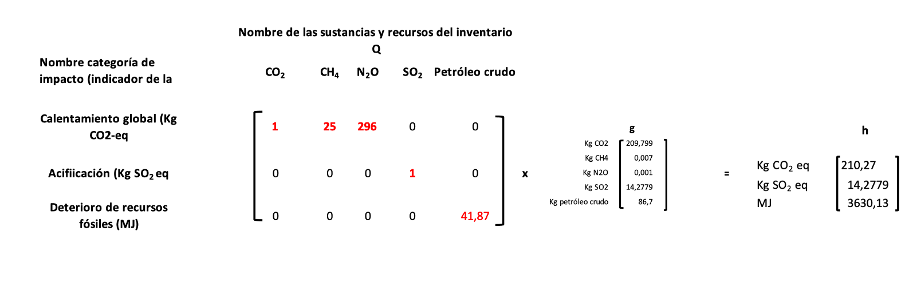

  

  
  <h1>ESTRUCTURA DE CÁLCULO MATEMÁTICO PARA MODELAR EL INVENTARIO Y EL IMPACTO AMBIENTAL DEL CICLO DE VIDA DE UN PRODUCTO </h1>
  <h1>SECCIÓN 4</h1>

  <h2>EVALUACIÓN DEL IMPACTO DE CICLO DE VIDA</h2>

### 1.1 Propósito de la sección
Aprenderás cómo es la estructura de cálculo matemático para evaluar el impacto de ciclo de vida.

### 1.2 Algunas consideraciones preliiminares

Para comenzar digamos que la EICV es un paso más de la metodología del análisis de ciclo de vida que consiste en transformar cada uno de los flujos ambientales en medidas de impacto potencial usando factores de caracerización que se han obtenido a partir de estudios de investigación en el campo de las ciencias naturales y ambientales. Llamar la atención que en el análisis de ciclo de vida se habla de **impactos potenciales** porque modelar impactos reales es muy complejo hacerlo. De acuerdo con ISO 14040:2006, se tiene tres pasos obligatorios  y otros voluntarios para realizar la evaluación  del impacto de ciclo de vida:

* Selección: Escogencia de las categorías de impacto apropiadas al objetivo del estudio de ciclo de vida (Paso obligatorio)
* Clasificación: La asignación de cada intervención ambiental a una o más categorías de impacto (Paso obligatorio). La clasificación incluye la cantidad de flujo ambiental (clasificaciómn cuantitativa) y clasificación por el nombre del flujo (clasificación cualitativa).
* Caracterización: Estimación de cuánto es el daño potencial relativo tanto a los seres humanos como a los ecosistemas derivado de una determinada cantidad de flujo ambiental que se ha obtenido en el inventario de ciclo de vida (Paso obligatorio).
* Normalización: Cálculo de la magnitud de un resultado que se obtiene en una categoría de impacto (que se expresa a través de un indicador de categoría), con respecto a una información de referencia (voluntario)
* Agrupamiento: Asignación de las categorías de impacto en grupos que tienen impactos parecidos (voluntario)
* Ponderación: Asignación del peso relativo a diferentes resultados de impacto, lo que puede permitir comparar el grado de importancia de una categoría de impacto frentre a otras (volunario).

Como lo señala Braunschweig (2023), los métodos de evaluación del impacto son más de naturaleza técnica que estratégica. De manera que es muy útil entender las fortalezas y debilidades de los métodos y qué casos es conveniente usarlos. Por ejempo, la huella de carbono expresada en Kg equivalentes de CO~2~, que suele ser una una unidad de medida estándar, deja de lado aspectos de toxicidad humana o escasez del agua y en general no tieme en cuenta los impactos a la biodeiversidad. El método de evaluación del impacto UseTox, por ejemplo, es apropiado para evaluar impacto de toxicidades pero solamente para ese propósito serviría. De otro lado, el método Recipe está muy bien desarrollado para temas de uso de materiales y energía y para toxicidades, pero es muy débil para la evaluación de la contaminación de aguas, solo para mencionar algunos aspectos. El método de Ecopuntos Suizo (otro método de un solo indicador) es muy amplio pero su uso básicamente es útil para el contexto de las políticas ambientales de Suiza. Si se desea profundizar en aspectos como la historia de la evaluación del impacto de ciclo de vida, los problemas que existen, las necesidades de investigación y criterios para escoger el método de impacto más apropiado puede consultar a Mikosch et al. (2022) y Hauschild & Huibregts (2015).

Toda vez que el presente curso tiene como objetivo fundamental ofrecer la estructura de cálculo para modelar el inventario de ciclo de vida y la evaluación del impacto de ciclo de vida, no nos detendremos entonces en discutir  a profundidad el tema de la evaluación del impacto, al respecto, existe abundante literatura de acceso libre y en bases de datos especializadas que hablan de manera extensa y discuten los pros y contras sobre este tema (e.g. Stranddorf et al., 2005; Pizzol et al., 2016), en aspectos como la selección de las categorías de impacto, o los tipos de categorías de impacto o los modelos de caracterización (que no son otra cosa que una forma de representación cuantitativa de la importancia relativa de una intervención ambiental específica con respecto a una sustancia de referencia). 

  ### 1.3 Estructura de cálculo matemático para hallar el impacto de ciclo de vida

Los modelos de caracterización describen la conexión causal entre los flujos ambientales y el cambio del indicador de la categoría de impacto. Este tipo de conexiones también denominadas mecanismos ambientales son un campo de investigación científica no solo en el campo del análisis de ciclo de vida sino en otros campos distintos. Ejemplo de modelos de caracterización son: Eco-indicator 99, CML 92, Impact 2002+, IPCC 2007, TRACI, Recipe, UseTox, Swiss Ecopoints, entre otros.

Así que haremos más bien énfasis en la estructura de cálculo matemático para calcular el impacto de ciclo de vida. Las explicaciones sobre la estructura de cálculo matemático para la evaluación del impacto que se ofrecen en esta sección se han basado principalmente en las explicaciones de Heijungs & Suh (2002) pero al respecto hemos obviado muchos aspectos técnicos matemáticamente hablando y hemos procurado hacer un énfasis en los aspectos prácticos de la aplicación de la estructura de cálculo matemático y de una manera lo más didáctica posible.

Para comenzar lo primero que hay que construir es la matriz de caracterización que la denotaremos con la letra **Q**. Veamos con base en el caso de la producción de probetas de aluminio cómo sería. Para ello iniciamos mostrando la información con el inventario de ciclo de vida e información relevante que necesario tener para aplicar la estructura básica matemática del inventario de ciclo de vida:

  

Ahora bien, teniendo en cuenta los resultados del inventario de ciclo de vida referido con anterioridad, de acuerdo con la base de datos de la Universidad de Leiden [Factores de caracterización](https://www.universiteitleiden.nl/en/research/research-output/science/cml-ia-characterisation-factors), el dióxido de carbono, metano y óxido nitroso se puede clasificar a la categoría de impacto denominada **calentamient global**, mientras que el dióxido de azufre se puede clasificar a la categoría de **acidificación**. El petróleo crudo puede clasificarse a la categoría de **deterioro de combustibles fósiles**. Todas estas son **categorías de impacto de punto medio**. Las categorías de punto medio son las más escogidas, porque es más fácil la comprensión del mecanismo ambiental cuando está más cerca del flujo ambiental. El punto medio (ejemplo, calentamiento global, acidificación, agotamiento del recurso hídrico) está en algún lugar entre el flujo ambiental y el punto final. Las categorías de impacto de punto final correspondeN al impacto que finalmente van a tener los flujos ambientales en términos de daño a lo que se denomina áreas de protección que son: **la salud humana**, **ambiente natural o recursos bióticos (plantas, animales)**, **recursos naturales o abióticos (minierales)** y **ambiente construido por el hombre (edificios, cosechas, carreteras)**. Para el mineral de la bauxita que se extrae de la naturaleza, la base de datos anterior clasifica este flujo ambiental en una categoría de punto final denominada deterioro de los recursos. Por lo que para nuestro ejemplo, tenemos que dejar de lado este flujo, toda vez que no podemos hacer clasificación mezclando categorías de impacto de punto final y categorías de punto medio como si fueran de la misma naturaleza o del mismo nivel. 

Por otro lado, es posible que debido al avance de las investigaciones científicas estos factores de caracterización estén actualizándose continuamente y tengan por lo tanto que estar cambiándose sus valores. Por ejemplo, el Grupo Intergubernamental de Expertos sobre el Cambio Climático (IPCC) ha venido actualizando los factores de caracterización para los gases de efecto invernadero que contribuyen a calentamiento global y el metano por ejemplo, en el último informe de evaluación (Assessment Report 6, AR6), el factor de cracterización (otras veces denominado potencial de calentamiento global) para el metano está en 27.2 actualmente, que significa que un Kg de metano causa el mismo calentamiento que 27.2 Kg de dióxido de carbono, por eso el indicador de la categoría de calientamiento global se expresa en Kg eqivalentes de CO2, donde CO2 es la sustancia d referencia con la cual se comparan las otras sustancias, de manera similar se pueden interpretar los otros factores de caracterización de otras categorías de impacto, por ejemplo, para la categoría acidficación, la sustancias de referencia es el dióxido de azufre. Tambiém a veces estos factores de caracterización cambian su valor según el método de evaluación del impacto escogido (cuando hablamos de métodos de evaluación, estamos hablando métodos que contemplan determinadas categorías de impacto, sustancias y recursos naturales ya clasificados en cada una de estas categorías y los factores de caracterización de cada una de estas sustancias y recursos naturales).

| Nombre del flujo ambiental        | Categoría de impacto (indicador categoría de impacto)      | Factor de caracterización    | Fuente donde se obtuvo el factor de caracterización    |
|-----------------------------------|-----------------------------|------------------------------|-----------------------------------------------------|
| Dióxido de carbono                | Calentamiento global (Kg CO2 eq)                           | 1                            | [Factores de emisión Universidad de Leiden](https://www.universiteitleiden.nl/en/research/research-output/science/cml-ia-characterisation-factors)                                         | 
| Metano                            | Calentamiento global        | 25                           | [Factores de emisión Universidad de Leiden](https://www.universiteitleiden.nl/en/research/research-output/science/cml-ia-characterisation-factors)                                             |
| Óxido nitroso                     | Calentamiento global        | 296                          | [Factores de emisión Universidad de Leiden](https://www.universiteitleiden.nl/en/research/research-output/science/cml-ia-characterisation-factors)                                             |
| Dióxido de azufre                 | Acidificación (Kg SO2 eq)   | 1                            |  [Factores de emisión Universidad de Leiden](https://www.universiteitleiden.nl/en/research/research-output/science/cml-ia-characterisation-factors)
| Petróleo crudo                    | Deterioro recursos fósiles (MJ)  | 41.87                   |  [Factores de emisión Universidad de Leiden](https://www.universiteitleiden.nl/en/research/research-output/science/cml-ia-characterisation-factors)

Para iniciar vamos a construir primero la matriz de caracterización que indicaremos con la letra **Q**. Solo para propósitos didácticos vamos a presentar la matriz indicando cuáles serían las unidades con que están representados cada una de los números que forman parte de esta matriz. No olvidar y suena tonto decirlo, pero en una matriz o vector solo se van a ver arreglos de números, nunca aparecerá información en forma de texto, pero para una comprensión mejor de lo que queremos explicar vamos esta vez a suponer que la matriz tiene información textual:

  

Para la representación de la "matriz anterior Q", vamos a explicar lo siguiente: Si aparece un número en una celda, este se en encuentra entre la intersección entre la sustancia o recurso del inventario y la categoría de impacto, esto lo que significa en primer lugar es que esa sustancia o recurso se ha clasificado en esa categoría de impacto y el valor que aparece en esa intersección es el factor de caracterización respectivo. Esta **matriz Q** la vamos a multiplicar por el vector de inventario g para obtener el **vector de impacto** que vamos a denotar con la letra **h**. Así que cuando se haga este producto matricial, lo que va a suceder es que se está multiplicando el factor de caracterización de la sustancias o recurso por la cantidad de inventario de dciha sustancia o recurso, de tal mamera que al hacer el producto y cancelarse unidades, va a quedar como resultado una cantidad que va a tener como unidades el indicador de la categoría respectiva, así que como se tiene una misma unidad de medida, se pueden sumar todas las contribuciones de impacto ambiental que se tuvieron como consecuencia de haber clasificado varias sustancias o recursos en esa categoría de impacto. Tambien es bueno anotar que para esta multiplicación la matriz Q no debe ser cuadrada, simplemente que se cumpla que el númdero de columnas de la matriz Q sea igual al número filas del vector g. También es importante señalar que si una sustancia no está formando parte de una categoría de impacto, entonces su factor de caracterización no existe y esto en la matriz Q se indica con un cero (0). También si una sustancia se puede clasificar a más de una categoría de impacto, se puede dividir el valor o cantidad de dicho flujo por el número de categorías de impacto y cada valor obtenido se clasifica a cada una de las categorías de impacto respectivas.

Una observación final, como el vector de inventario arroja un total aproximado de 102 litros de petróleo crudo que se necesitaron para satisfacer la demanda (100 probetas de aluminio) y como el factor de caracterización está dado en la categoría deterrioro de recursos fósiles en MJ/Kg de petróleo crudo, se debe convertir los 102 litros en Kg. Para hacer esto tener en cuenta las siguientes consideraciones:

Para convertir un litro de petróleo crudo a kilogramos, necesitamos conocer la densidad del petróleo crudo en kilogramos por litro (kg/L). La densidad del petróleo crudo puede variar según su tipo y origen, pero generalmente se encuentra en un rango de 0.8 a 0.95 kg/L.

La fórmula para la conversión es la siguiente:
Masa (en kg) = Volumen (en L) × Densidad (en kg/L)

Supongamos que la densidad del petróleo crudo es de 0.85 kg/L. Entonces, para convertir un litro de petróleo crudo a kilogramos, usaríamos la fórmula:

Masa (en Kg) = 102 L x 0.85 Kg/L = 86.7 Kg de petróleo crudo

Vamos entonces a indicar los resultados de la evaluación del impacto con el vector h, así que la fórmula para calcular el impacto de ciclo de vida es la siguiente:

  <strong>h = Qg</strong>

Veamos entonces cómo sería el vector de impacto **h** con los datos del ejercicio, teniendo en cuenta que los datos del vector de inventario **g** se toman en valor absoluto, es decir que aquellos resultados que tengan signo negativo aparecerán con signo positivo.

  

Como se puede ver en los resultados del impacto que se muestran en el vector h, están en términos del indicador de la categorñia de impacto, que es la unidad de medida en que se expresan los resultados del impacto de esa categoría. Así que todas los flujos ambientales que se clasifiquen en esa categoría, su contribución en términos de impacto en esa categoría se expresan en esta unidad de medida, lo que permite después sumar cada contribución de impacto de cada flujo ambiental para obtener al final un solo resultado de impacto expresado en la unidad de medida o indicador de la categoría de impacto respectiva.

Desde el punto de vista de la estructura de cálculo eso es todo lo que habría que explicar de cómo se obtiene el impacto de ciclo de vida habiendo tenido en cuenta los elementos que son obligatorios para este paso en un estudio de análisis de ciclo de vida. 

Finalmente, para efectos de cómo llevar la normalización, ponderación y agrupamiento, que son elementos voluntarios en la evaluación del impacto,  sugerimos consular Heijungs & Suh (2002) y Stranddorf et al. (2005).

   
   

  

